# Lecture 3 Figures

## Physical Setup

1. **00:05:00 — Vertical-light elevator**
   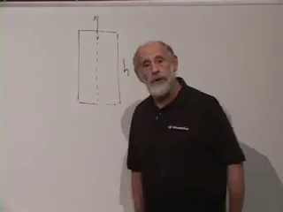
   The completed elevator diagram retains the height \(h\), vertical ray,
   and acceleration direction.

2. **00:12:05 — Free-fall cancellation**
   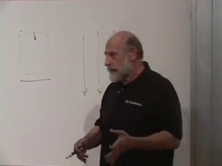
   The board records the freely falling apparatus and the opposing
   frequency-shift effects.

3. **00:14:25 — Accelerated coordinates**
   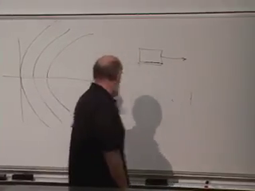
   Curved meter-stick trajectories represent the accelerating coordinate
   grid.

4. **00:17:40 — Tidal obstruction**
   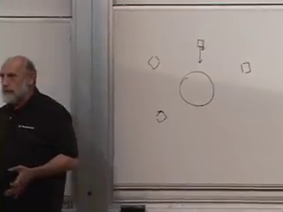
   Local laboratories around a central source require different
   acceleration directions.

## Coordinate and Tensor Calculus

5. **00:23:00 — Coordinates and scalar field**
   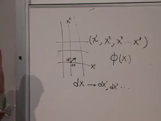

6. **00:25:40 — Total differential**
   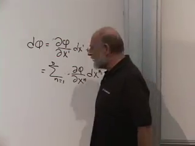

7. **00:35:05 — Chain rule**
   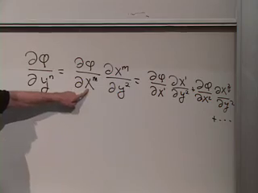

8. **00:40:10 — Two coordinate grids**
   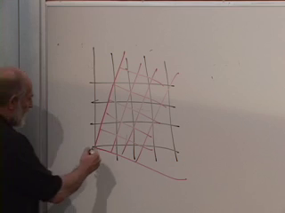

9. **00:47:30 — Scalar and displacement vector**
   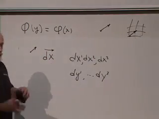

10. **00:51:15 — Contravariant vector law**
    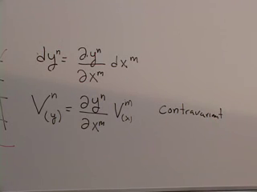

11. **00:59:40 — Rank-two contravariant law**
    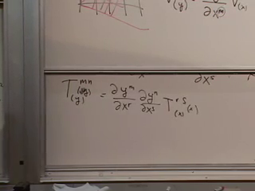

12. **01:07:40 — Vector and covector laws**
    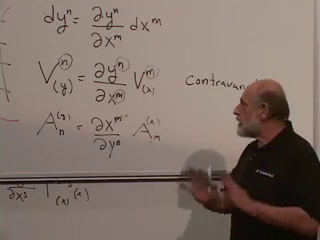

13. **01:11:45 — Rank-two covariant law**
    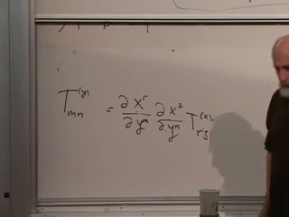

## Metric and Geometry

14. **01:22:20 — Cartesian metric**
    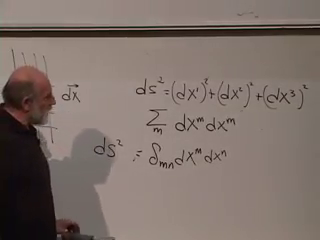

15. **01:28:10 — Transformed metric**
    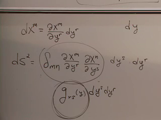

16. **01:36:40 — Cone and local patch**
    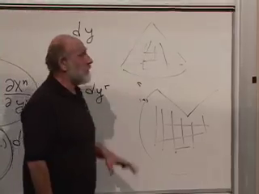

17. **01:41:55 — Polar differentials**
    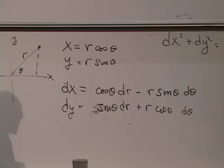

18. **01:45:45 — Polar metric components**
    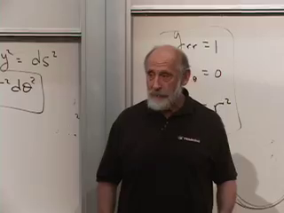

19. **01:49:30 — Sphere coordinates**
    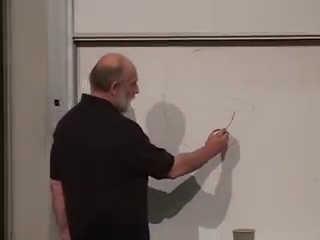
