# Lecture 4 Figures

## Tensor Algebra

1. **00:12:35 — Chain-rule archetypes**
   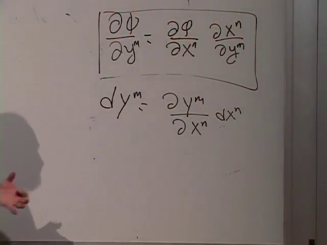

2. **00:17:45 — Rank-two transformation laws**
   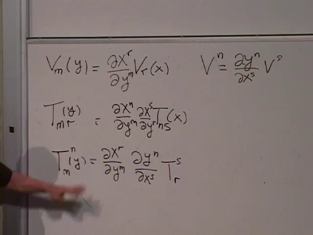

3. **00:22:35 — Trace contraction**
   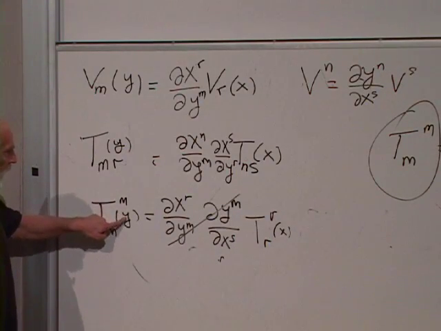

4. **00:28:35 — Metric line element**
   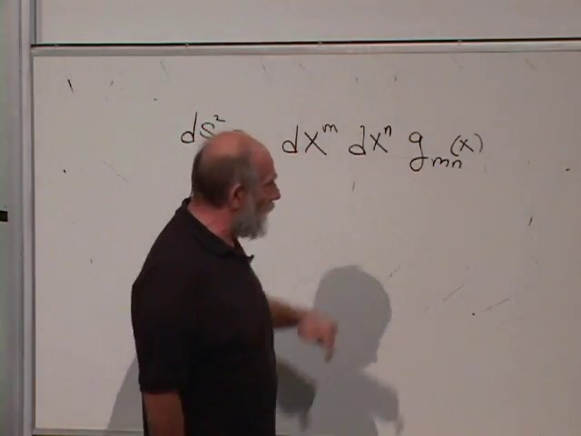

5. **00:31:25 — Metric transformation**
   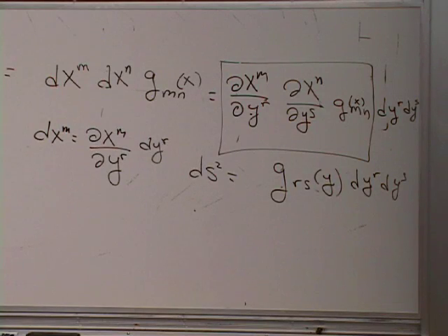

6. **00:36:55 — Inverse metric identity**
   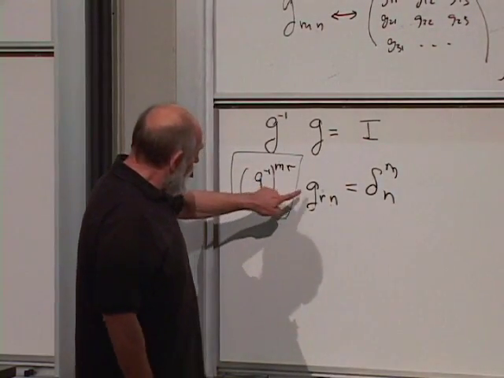

7. **00:43:15 — Lowering a vector index**
   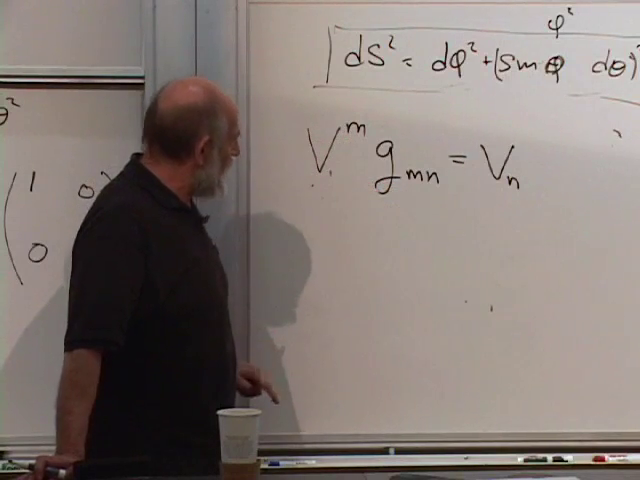

8. **00:47:45 — Symmetric metric**
   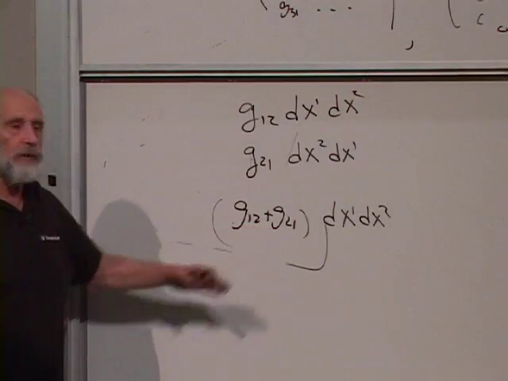

9. **00:52:30 — Raising tensor indices**
   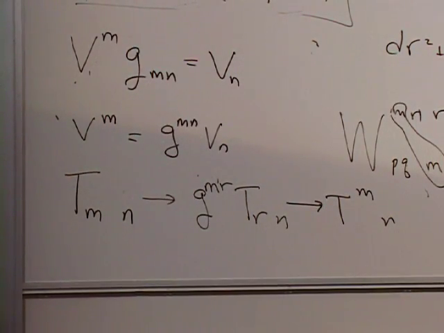

10. **00:58:15 — Three interval contractions**
    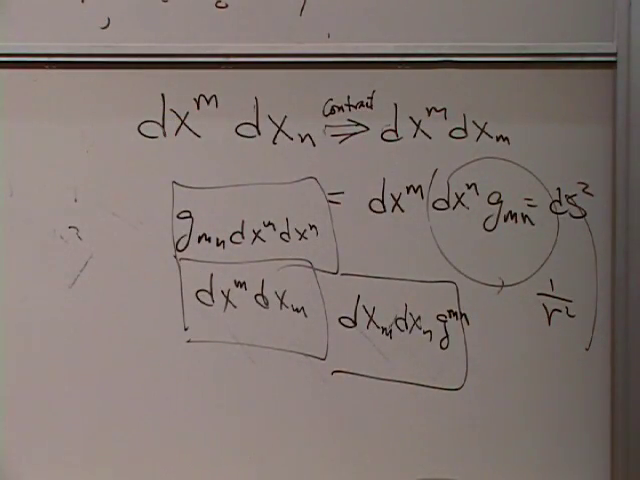

11. **01:02:40 — Tensor equality**
    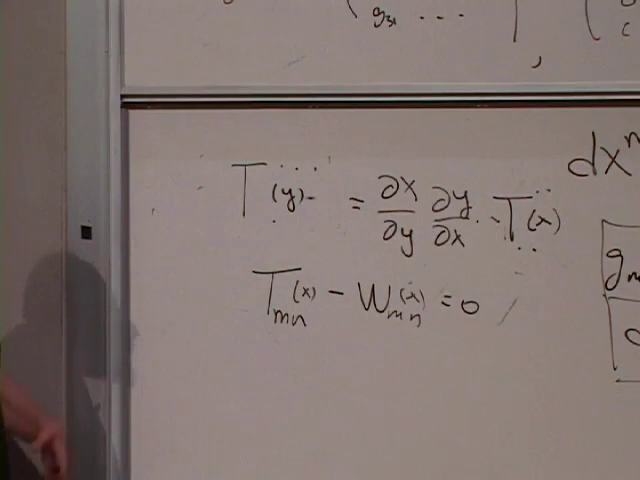

## Spacetime

12. **01:09:25 — Cartesian frames**
    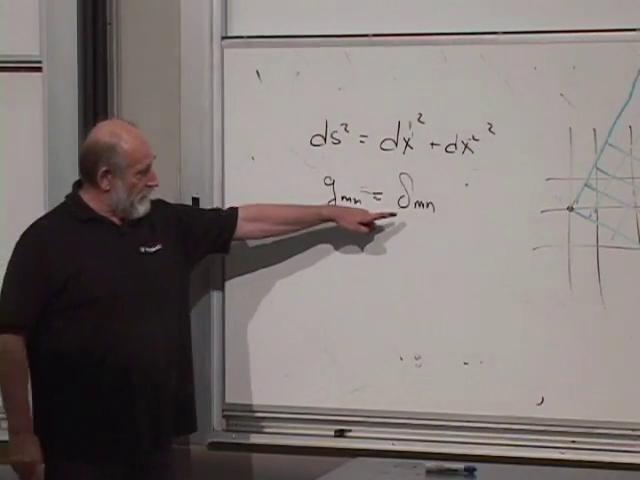

13. **01:13:35 — Proper time in \(1+1\) dimensions**
    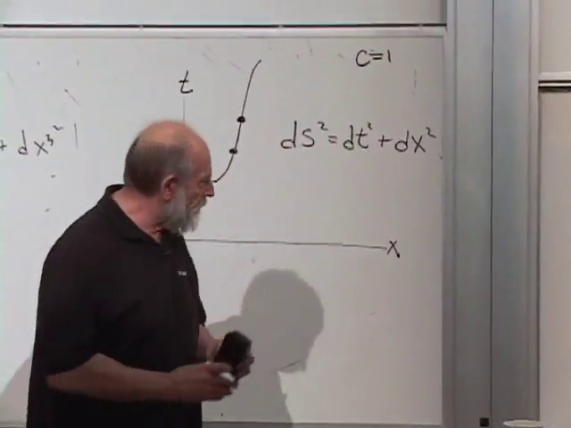

14. **01:18:40 — Proper time in \(3+1\) dimensions**
    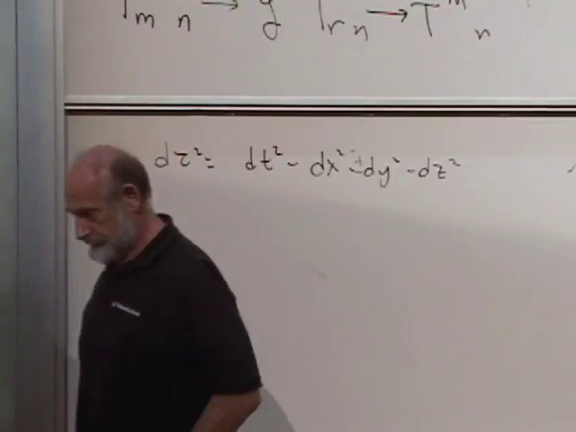

15. **01:22:45 — General spacetime metric**
    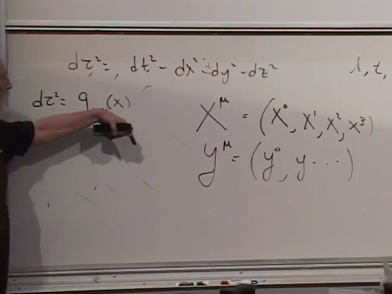

16. **01:26:10 — Minkowski metric**
    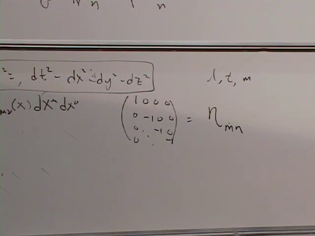

17. **01:32:30 — Time-dependent scale factor**
    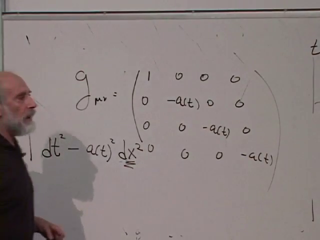

18. **01:35:30 — Sphere metric**
    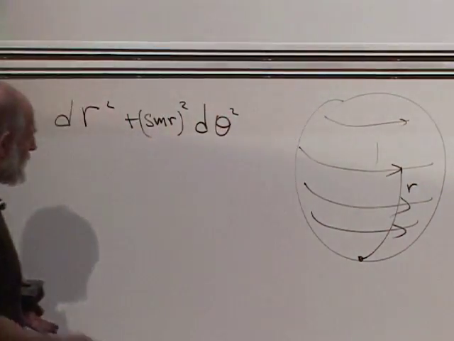

19. **01:37:35 — Horn and radial profile**
    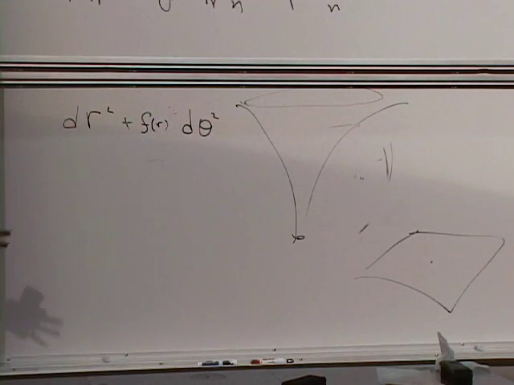
